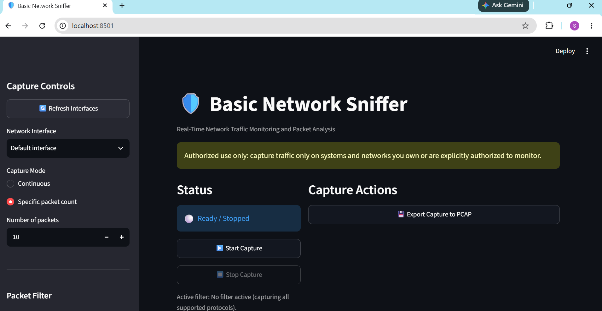
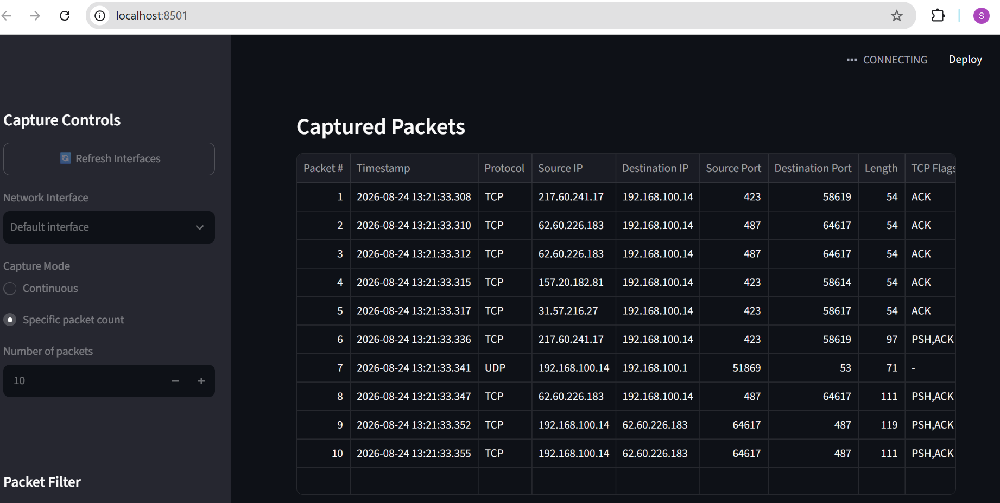
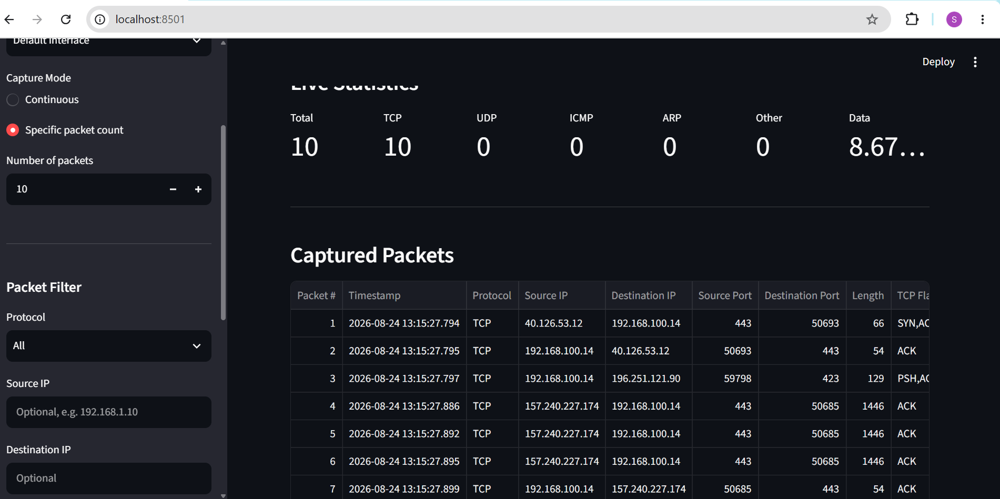
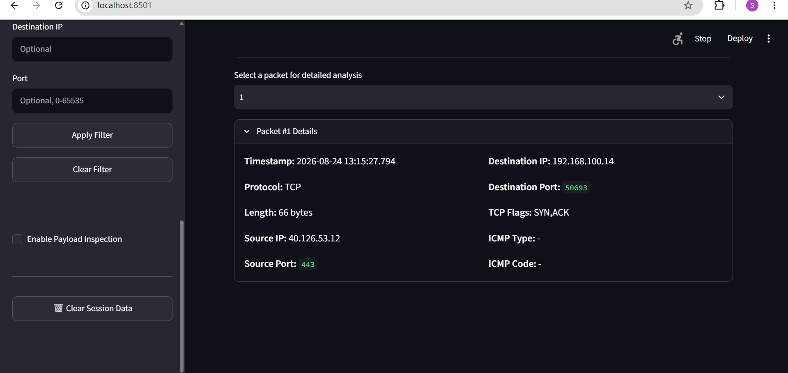
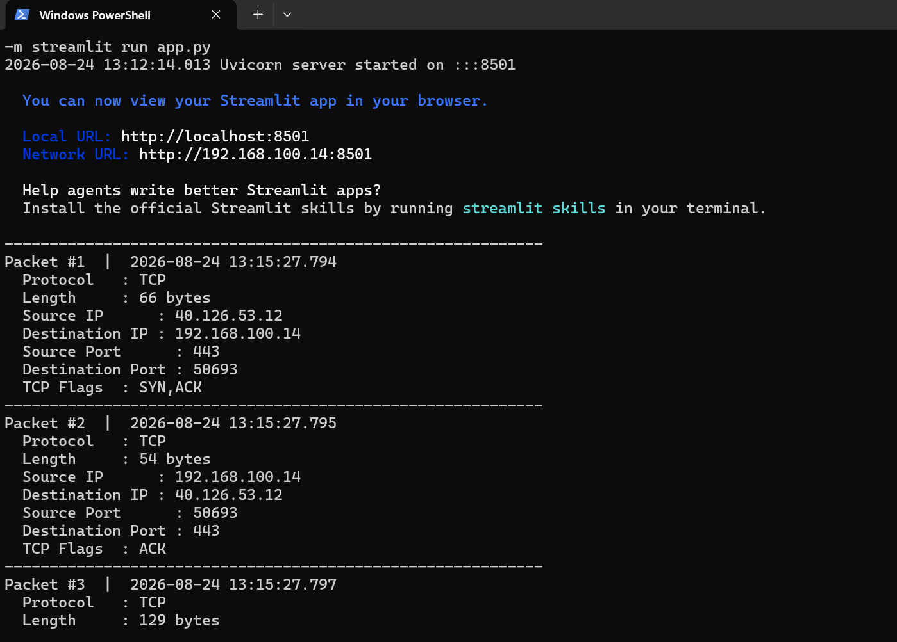

# 🛡️ Basic Network Sniffer

<p align="center">
  <b>Real-Time Network Traffic Monitoring and Packet Analysis</b>
</p>

<p align="center">
  A Python-based network packet sniffer with a modern web dashboard for capturing, analyzing, filtering, and exporting network traffic.
</p>

<p align="center">

  
  
  
  
  

</p>

---

## 📌 About the Project

**Basic Network Sniffer** is a Python-based cybersecurity project developed to capture and analyze network packets in real time.

The application combines a packet-capture backend built with **Scapy** and a modern interactive dashboard built with **Streamlit**. Users can select a network interface, capture live traffic, filter packets, inspect packet details, view protocol statistics, and export captured traffic to PCAP format.

The project was developed as part of the **CodeAlpha Cyber Security Internship** task requirements.

> ⚠️ **Authorized Use Only:** This project should only be used on systems and networks that you own or where you have explicit permission to monitor network traffic.

---

# ✨ Features

### 📡 Live Packet Capture
Capture network packets in real time from available network interfaces.

### 🔢 Specific Packet Capture
Capture a selected number of packets instead of running continuously.

### 🌐 Network Interface Selection
Refresh and select available network interfaces before starting a capture.

### 🔎 Packet Filtering
Filter captured traffic using:

- Protocol
- Source IP address
- Destination IP address
- Port number

### 📊 Live Statistics
Monitor packet statistics including:

- Total packets
- TCP packets
- UDP packets
- ICMP packets
- ARP packets
- Other packets
- Total captured data

### 📋 Packet Table
Captured packets are displayed in a structured table containing useful information such as:

- Packet number
- Timestamp
- Protocol
- Source IP
- Destination IP
- Source port
- Destination port
- Packet length
- TCP flags

### 🔬 Detailed Packet Analysis
Select an individual packet to view its detailed information.

### 📦 Payload Inspection
Optional payload inspection can be enabled when required.

### 💾 PCAP Export
Export captured packets to `.pcap` format for further analysis using tools such as Wireshark.

### 🖥️ Modern Web Dashboard
A Streamlit-based frontend provides an easy-to-use interface for controlling packet capture and viewing results.

---

# 🛠️ Technologies Used

| Technology | Purpose |
|---|---|
| Python | Core application development |
| Scapy | Packet capture and packet analysis |
| Streamlit | Interactive web frontend |
| Npcap | Packet capture support on Windows |
| PCAP | Standard packet capture file format |

---

# 📁 Project Structure

```text
CodeAlpha_BasicNetworkSniffer/
│
├── app.py                  # Streamlit web application
├── main.py                 # Command-line application
├── requirements.txt        # Project dependencies
├── README.md               # Project documentation
├── LICENSE                 # Project license
├── .gitignore              # Git ignore rules
│
├── src/
│   ├── __init__.py
│   ├── filters.py          # Packet filtering functionality
│   ├── packet_analyzer.py  # Packet analysis and field extraction
│   ├── sniffer.py          # Core packet capture functionality
│   ├── statistics.py       # Capture statistics
│   └── utils.py            # Utility functions
│
├── screenshots/
│   ├── 01-dashboard-ready.png
│   ├── 02-packet-capture.png
│   ├── 03-live-statistics.png
│   ├── 04-packet-details.png
│   └── 05-terminal-capture.png
│
└── captures/
    └── Saved PCAP capture files
```

---

# 🚀 Installation

## 1. Clone the Repository

```bash
git clone https://github.com/YOUR-USERNAME/YOUR-REPOSITORY.git
cd YOUR-REPOSITORY
```

Or download the project as a ZIP file and extract it.

---

## 2. Create a Virtual Environment

```bash
py -m venv venv
```

Activate it on Windows:

```bash
.\venv\Scripts\Activate.ps1
```

If you do not want to use a virtual environment, you can install the dependencies directly.

---

## 3. Install Dependencies

```bash
py -m pip install --upgrade pip
py -m pip install -r requirements.txt
```

---

# 🪟 Windows Requirement: Install Npcap

For live packet capture on Windows, **Npcap** is required.

During installation, make sure the packet capture driver is installed successfully.

After installation, restart your terminal if necessary.

> The application may also require Administrator privileges for live packet capture.

---

# ▶️ Running the Web Dashboard

From the project folder, run:

```bash
py -m streamlit run app.py
```

The application should open in your browser.

By default, Streamlit commonly runs on:

```text
http://localhost:8501
```

---

# 💻 Running the Command-Line Version

The project also includes a terminal-based interface.

Run:

```bash
py main.py
```

For live packet capture on Windows, run PowerShell or Command Prompt with appropriate privileges if required.

---

# 🧭 How to Use

## Step 1 — Refresh Network Interfaces

Click **Refresh Interfaces** to detect available network interfaces.

## Step 2 — Select an Interface

Choose the network interface you want to monitor.

## Step 3 — Select Capture Mode

Choose one of the available modes:

- Continuous capture
- Specific packet count

## Step 4 — Configure Optional Filters

You can filter traffic by:

- Protocol
- Source IP
- Destination IP
- Port

## Step 5 — Start Capture

Start the packet capture process.

Captured packets will appear in the dashboard.

## Step 6 — View Statistics

Monitor the number and type of captured packets.

## Step 7 — Inspect a Packet

Select a packet to view detailed information such as IP addresses, ports, protocol, packet length, and TCP flags.

## Step 8 — Export the Capture

Export the captured session to a PCAP file for further analysis.

---

# 📸 Application Screenshots

## 🏠 Dashboard Ready

The application dashboard before packet capture begins.



---

## 📡 Live Packet Capture

The dashboard actively capturing network packets.



---

## 📊 Live Statistics and Captured Packets

Protocol statistics and captured packet information displayed in the application.



---

## 🔬 Detailed Packet Analysis

Detailed information for a selected captured packet.



---

## 💻 Terminal Packet Capture

The command-line version of the application successfully capturing and displaying network packets.



---

# 📊 Packet Information

The application can display information including:

| Field | Description |
|---|---|
| Packet Number | Sequential number of the captured packet |
| Timestamp | Time when the packet was captured |
| Protocol | Network protocol detected |
| Source IP | IP address where the packet originated |
| Destination IP | IP address receiving the packet |
| Source Port | Originating TCP/UDP port |
| Destination Port | Receiving TCP/UDP port |
| Length | Packet size in bytes |
| TCP Flags | TCP connection control flags |
| ICMP Type | Type of ICMP packet when applicable |
| ICMP Code | ICMP code when applicable |

---

# 🔐 Supported Protocols

The application can identify and organize common protocols including:

- TCP
- UDP
- ICMP
- ARP
- Other supported packet types

---

# 💾 PCAP Export

Captured packets can be exported to a standard `.pcap` file.

These files can be opened using network analysis tools such as Wireshark for further inspection.

Example:

```text
captures/capture_YYYYMMDD_HHMMSS.pcap
```

---

# ⚠️ Security and Ethical Use

This project is intended strictly for:

- Educational purposes
- Personal learning
- Lab environments
- Authorized security testing
- Networks and systems owned by the user
- Networks where explicit permission has been granted

Do **not** use this application to monitor, intercept, or inspect network traffic without authorization.

The project is designed as an educational network analysis tool and does not attempt to bypass security controls or decrypt encrypted traffic.

---

# ⚙️ Limitations

- Live packet capture may require Administrator or elevated privileges.
- Windows systems require Npcap for packet capture functionality.
- Encrypted traffic cannot be decrypted by the application.
- The tool is designed for educational use and is not intended to replace enterprise network analysis platforms.
- Packet visibility depends on the selected interface and network environment.

---

# 🔮 Future Improvements

Possible future improvements include:

- IPv6-specific packet analysis
- Advanced traffic visualization
- Graphs and charts for protocol activity
- Suspicious traffic alerts
- Port scan detection
- PCAP file upload and offline analysis
- Search functionality for captured packets
- Dark/light dashboard themes
- Automated anomaly detection

---

# 👨‍💻 Internship Task

This project was developed for the **Basic Network Sniffer** task of the CodeAlpha Cyber Security Internship.

The main objective of the task was to:

- Capture network traffic packets
- Analyze packet structure and content
- Understand network communication
- Identify protocols
- Display source and destination information
- Work with packet capture libraries such as Scapy

The completed project extends these core requirements with filtering, statistics, PCAP export, detailed packet analysis, and a web-based dashboard. :contentReference[oaicite:1]{index=1}

---

# 📄 License

This project is available under the terms of the included MIT License.

---

<p align="center">
  Built for learning, experimentation, and authorized network analysis 🛡️
</p>
